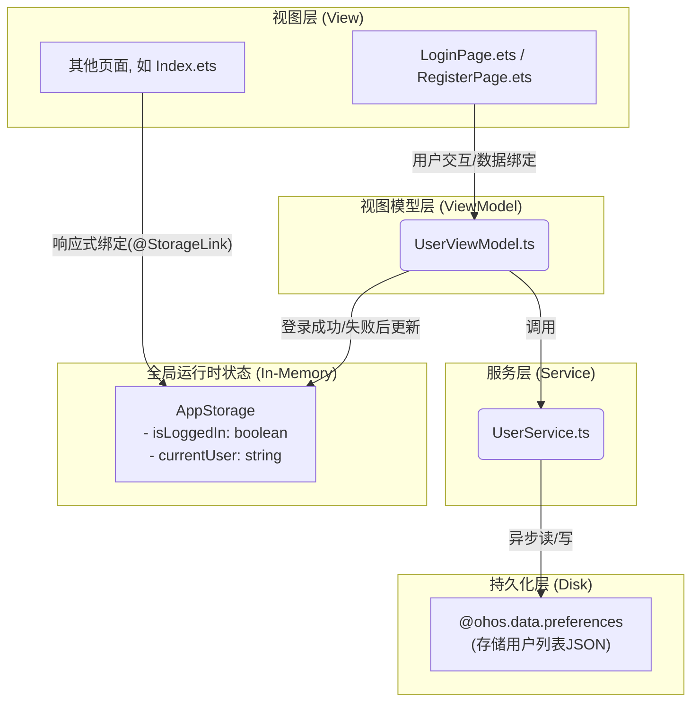

# **阶段二详细架构设计与实现指南**

**版本：V1.0**

**目标：** 本文档为《开发计划书》中的“阶段二：用户中心模块”提供详细的技术实现指导。它基于已确立的MVVM项目架构，旨在确保 `UserService`、`UserViewModel` 和相关视图之间的代码实现高度规范、职责清晰。

---

## **1. 核心数据流回顾**

在开始编码前，请再次回顾我们在 `项目架构.md` 中定义的核心数据流。阶段二的开发将严格遵循此模式：



---

## **2. 详细实现指南**

### **任务 2.2：实现 `service/UserService.ts` (数据持久化核心)**

**职责：** 唯一、独立地负责与 `@ohos.data.preferences` 交互，封装所有关于用户数据的本地存储操作。**任何其他模块（包括ViewModel）都不能直接引用 `preferences` API。**

**实现细节：**

1.  **定义常量:** 在 `common/Constants.ts` 中定义 `preferences` 所需的常量，避免硬编码。
    ```typescript
    // common/Constants.ts
    export const PREFERENCES_NAME = 'MyPreferences';
    export const KEY_USERS_LIST = 'UsersList';
    ```

2.  **`UserService.ts` 结构:**
    ```typescript
    import data_preferences from '@ohos.data.preferences';
    import { User } from '../model/User';
    import { PREFERENCES_NAME, KEY_USERS_LIST } from '../common/Constants';

    class UserService {
      private async getPreferences(): Promise<data_preferences.Preferences> {
        // 封装获取Preferences实例的逻辑
        return await data_preferences.getPreferences(getContext(this), PREFERENCES_NAME);
      }

      // 注册用户
      async registerUser(newUser: User): Promise<boolean> {
        const prefs = await this.getPreferences();
        // 1. 读取原始数据
        const usersJson = await prefs.get(KEY_USERS_LIST, '[]') as string;
        const users: User[] = JSON.parse(usersJson);

        // 2. 检查用户是否存在
        if (users.some(u => u.username === newUser.username)) {
          console.error('User already exists.');
          return false; // 返回false表示注册失败
        }

        // 3. 添加新用户并写回
        users.push(newUser);
        await prefs.put(KEY_USERS_LIST, JSON.stringify(users));
        await prefs.flush(); // 确保数据写入磁盘
        return true; // 返回true表示成功
      }

      // 登录验证
      async login(username: string, password: string): Promise<User | null> {
        const prefs = await this.getPreferences();
        const usersJson = await prefs.get(KEY_USERS_LIST, '[]') as string;
        const users: User[] = JSON.parse(usersJson);

        // 查找并验证用户
        const foundUser = users.find(u => u.username === username && u.password === password);
        return foundUser || null; // 找到则返回User对象，否则返回null
      }
    }

    export const userService = new UserService();
    ```

### **任务 2.3 & 2.4：实现 `UserViewModel` 并重构视图**

**职责：**
*   `UserViewModel`: 处理所有UI业务逻辑（校验、调用Service），并更新 `AppStorage` 中的全局状态。
*   `View (LoginPage/RegisterPage)`: 变得“轻量”，仅负责UI渲染和将用户事件转发给 `UserViewModel`。

**实现细节：**

1.  **`viewmodel/UserViewModel.ts` 结构:**
    ```typescript
    import { User } from '../model/User';
    import { userService } from '../service/UserService';
    import { KEY_IS_LOGGED_IN, KEY_CURRENT_USER } from '../common/Constants';
    import AppStorage from '@ohos.AppStorage';

    export class UserViewModel {
      async handleRegister(user: User): Promise<boolean> {
        // 可在此处添加更多校验逻辑
        if (!user.username || !user.password) {
          return false;
        }
        return await userService.registerUser(user);
      }

      async handleLogin(username: string, password: string): Promise<boolean> {
        const user = await userService.login(username, password);
        if (user) {
          // 登录成功，更新AppStorage
          AppStorage.SetOrCreate(KEY_IS_LOGGED_IN, true);
          AppStorage.SetOrCreate(KEY_CURRENT_USER, user.username);
          return true;
        } else {
          // 登录失败，确保状态为登出
          AppStorage.SetOrCreate(KEY_IS_LOGGED_IN, false);
          AppStorage.SetOrCreate(KEY_CURRENT_USER, '');
          return false;
        }
      }
    }
    ```

2.  **`pages/LoginPage.ets` 重构示例:**
    ```typescript
    import { UserViewModel } from '../viewmodel/UserViewModel';
    import router from '@ohos.router';
    // ... 其他导入

    @Entry
    @Component
    struct LoginPage {
      @State username: string = '';
      @State password: string = '';
      private viewModel: UserViewModel = new UserViewModel();

      build() {
        Column() {
          // ... UI元素如TextInput绑定 @State(this.username) 和 @State(this.password)

          Button('登录')
            .onClick(async () => {
              const loginSuccess = await this.viewModel.handleLogin(this.username, this.password);
              if (loginSuccess) {
                // 登录成功，跳转到首页
                router.replaceUrl({ url: 'pages/Index' }); // 使用replace避免返回登录页
              } else {
                // 登录失败，显示提示弹窗
                // dialog.show(...)
              }
            })
        }
      }
    }
    ```
    **`RegisterPage.ets` 的重构方式与 `LoginPage.ets` 完全类似。**

### **任务 2.5：实现全局登录状态管理**

**职责：** 应用中的任何其他页面（如此处的首页 `Index.ets`）都能响应登录状态的变化。

**实现细节：**

1.  **定义 `AppStorage` Keys:** 在 `common/Constants.ts` 中添加。
    ```typescript
    // common/Constants.ts
    // ... 已有常量
    export const KEY_IS_LOGGED_IN = 'isLoggedIn';
    export const KEY_CURRENT_USER = 'currentUser';
    ```

2.  **`pages/Index.ets` 中监听状态:**
    ```typescript
    import { KEY_IS_LOGGED_IN, KEY_CURRENT_USER } from '../common/Constants';
    // ... 其他导入

    @Entry
    @Component
    struct Index {
      // 使用@StorageLink与AppStorage中的变量建立双向同步
      @StorageLink(KEY_IS_LOGGED_IN) isLoggedIn: boolean = false;
      @StorageLink(KEY_CURRENT_USER) currentUser: string = '';

      build() {
        Column() {
          // ... 其他UI组件

          // 根据登录状态显示不同内容
          if (this.isLoggedIn) {
            Text(`欢迎您, ${this.currentUser}`)
          } else {
            Text('欢迎您, 请登录')
              .onClick(() => {
                // router.pushUrl(...) 跳转到登录页
              })
          }

          // ... 其他UI组件
        }
      }
    }
    ```

---

**总结:**

遵循此详细指南，开发团队可以确保阶段二的功能实现不仅满足需求，而且在代码层面严格遵守既定的MVVM架构，为后续阶段的开发和维护打下坚实的基础。