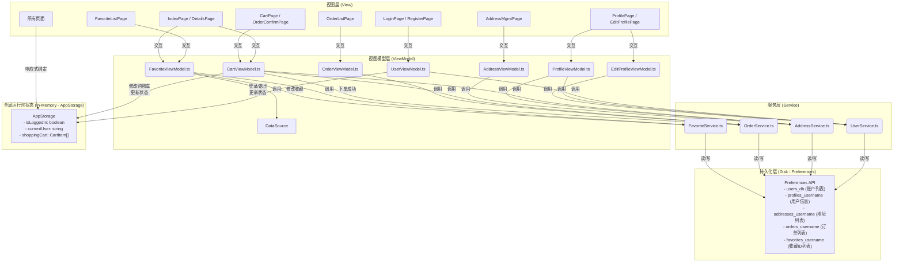

## **项目架构设计书 - 简易购物平台**

**版本：V1.3**
**目标：** 为“拼夕夕商店”项目建立一个遵循MVVM设计模式、职责分离、模块化、易于维护和扩展的软件架构，以支持包括个人中心、订单管理、收藏、地址管理、增强支付流程和商品搜索在内的丰富功能。

### **1. 核心架构理念：MVVM**

*(保持不变)* 我们将继续采用\*\*MVVM（Model-View-ViewModel）\*\*作为核心架构模式。面对增加的复杂性，MVVM的解耦能力将更加关键。

* **Model**: 扩展以包含`Address`, `Order`, `OrderItem`模型。数据服务层将更加细化。
* **View**: 新增多个页面（个人中心、编辑资料、地址管理、订单列表、收藏列表、订单确认）和可复用组件（地址项、订单项、收藏项）。
* **ViewModel**: 新增多个ViewModel来处理新模块的业务逻辑和状态。

### **2. 项目目录结构 `(V1.1 更新)`**

为了容纳新功能并保持清晰，目录结构需要扩展：

```
/entry/src/main/ets
├── common/
│   └── Constants.ts          // 应用常量 (AppStorage Keys, Preferences Keys/文件名)
│
├── model/                    // 数据模型接口
│   ├── Product.ts
│   ├── User.ts
│   ├── CartItem.ts
│   ├── Address.ts            // (新增) 收货地址模型
│   ├── Order.ts              // (新增) 订单模型
│   ├── OrderItem.ts          // (新增) 订单项模型
│   └── DataSource.ts         // 硬编码的商品数据源
│
├── service/                  // 数据服务层 (封装 Preferences 交互)
│   ├── UserService.ts          // 用户账户、基础信息管理
│   ├── AddressService.ts       // (新增) 用户收货地址 CRUD 服务
│   ├── OrderService.ts         // (新增) 用户订单 CRUD 服务
│   └── FavoriteService.ts      // (新增) 用户商品收藏 CRUD 服务
│
├── view/                     // 可复用 UI 组件
│   ├── ProductCard.ets
│   ├── CartItemView.ets
│   ├── BottomTabs.ets          // 底部导航栏容器
│   ├── AddressItem.ets         // (新增) 地址列表项组件
│   ├── OrderItemSummary.ets    // (新增) 订单列表项摘要组件
│   └── FavoriteItem.ets        // (新增) 收藏列表项组件
│
├── viewmodel/                // 视图模型 (业务逻辑与状态)
│   ├── UserViewModel.ts        // 登录/注册/基础信息 ViewModel
│   ├── CartViewModel.ts        // 购物车 & 订单确认 ViewModel (增强)
│   ├── ProfileViewModel.ts     // (新增) 个人中心主页 ViewModel
│   ├── EditProfileViewModel.ts // (新增) 编辑个人信息 ViewModel
│   ├── AddressViewModel.ts     // (新增) 地址管理 ViewModel
│   ├── OrderViewModel.ts       // (新增) 订单列表 ViewModel
│   └── FavoriteViewModel.ts    // (新增) 收藏列表 ViewModel
│
└── pages/                    // 页面 (View)
    ├── Index.ets               // 首页 (含搜索、收藏按钮)
    ├── CartPage.ets            // 购物车页面
    ├── DetailsPage.ets         // 商品详情页 (含收藏按钮)
    ├── LoginPage.ets
    ├── RegisterPage.ets
    ├── ProfilePage.ets         // (新增) 个人中心主页
    ├── EditProfilePage.ets     // (新增) 编辑个人信息页
    ├── AddressManagementPage.ets // (新增) 地址管理页
    ├── OrderListPage.ets       // (新增) 我的订单页
    ├── FavoriteListPage.ets    // (新增) 我的收藏页
    ├── OrderConfirmationPage.ets // (新增) 订单确认页
    └── CheckoutSuccessPage.ets // 支付成功页
```

### **3. 数据流与状态管理架构 `(V1.1 更新)`**

数据管理的复杂性增加，需要更精细的划分。

**架构图:**



**详细说明:**

1. **持久化层 (`Preferences`)**:
   * 现在存储多种类型的数据，**严格按用户隔离**。使用 `username` 作为 key 的一部分（如 `orders_username`, `favorites_username`）是实现多用户数据隔离的关键。
   * 由各自的 **Service 类** 独占访问。例如，`OrderService.ts` 负责所有与 `orders_username` 相关的读写操作。

2. **服务层 (`Service`)**:
   * **职责细化**: 每个 Service 负责一个特定领域的数据持久化逻辑（用户账户、地址、订单、收藏）。
   * **接口**: 对外提供清晰的异步接口（如 `OrderService.getOrders(username)`, `FavoriteService.addFavorite(username, productId)`）。
   * **数据转换**: Service 内部负责 JSON 序列化/反序列化。

3. **视图模型层 (`ViewModel`)**:
   * **数量增加**: 新增多个 ViewModel 对应新的页面和功能模块。
   * **逻辑封装**: 每个 ViewModel 负责其对应视图的业务逻辑（如计算总价、验证表单、调用 Service 获取/保存数据、更新 `AppStorage`）。
   * **跨 ViewModel 协作**: 可能存在少量协作，例如 `CartViewModel` 在下单时需要调用 `OrderService`，并可能需要从 `AddressService` 获取默认地址。

4. **全局运行时状态 (`AppStorage`)**:
   * 职责保持不变：管理**临时性、全局性**的 UI 状态（登录状态、当前用户、购物车）。
   * **注意**: 用户的个人信息（电话、地址）、订单、收藏等**持久化数据不应直接放入 AppStorage**，ViewModel 应在使用时从 Service 获取。

5. **本地UI状态 (`@State`)**:
   * 继续用于管理组件内部的临时状态（输入框内容、搜索关键词、加载状态等）。

### **4. 导航（Routing）架构 `(V1.1 更新)`**

1. **主导航容器 (`BottomTabs.ets`)**:
   * 包含**三个** `TabContent`，分别对应 `Index.ets` (首页)、`CartPage.ets` (购物车页) 和 `ProfilePage.ets` (我的)。

2. **页面跳转 (`router`)**:
   * **`router.pushUrl()`**: 用于导航到所有非 Tab 页面的次级页面。
     * `Index` -> `DetailsPage`
     * `Index` (未登录时) -> `LoginPage`
     * `ProfilePage` -> `EditProfilePage`
     * `ProfilePage` -> `AddressManagementPage`
     * `ProfilePage` -> `OrderListPage`
     * `ProfilePage` -> `FavoriteListPage`
     * `CartPage` -> `OrderConfirmationPage`
     * `OrderConfirmationPage` -> `CheckoutSuccessPage`
   * **`router.replaceUrl()`**:
     * `LoginPage` <-> `RegisterPage`
   * **`router.back()`**: 用于从次级页面返回。

### **5. 实施建议 `(V1.1 更新)`**

面对增加的复杂性，建议采用分层、分模块的开发策略：

1. **基础建设**:
   * 更新目录结构，创建所有新文件。
   * 定义所有 `model`。
   * 实现所有 `Service` 类，彻底解决数据持久化问题。**优先测试 Service 层**。

2. **核心流程**:
   * 实现用户注册/登录流程 (`UserService`, `UserViewModel`, `LoginPage`, `RegisterPage`)。
   * 实现商品浏览和详情 (`DataSource`, `IndexPage`, `DetailsPage`)。
   * 实现购物车基础功能 (`CartViewModel`, `CartPage`, `AppStorage`)。

3. **新模块逐一击破**:
   * **个人中心**: `ProfileViewModel`, `ProfilePage`, 退出登录。
   * **收藏**: `FavoriteService`, `FavoriteViewModel`, `FavoriteListPage`, 在首页/详情页添加收藏按钮。
   * **地址管理**: `AddressService`, `AddressViewModel`, `AddressManagementPage`。
   * **订单与支付**: 增强 `CartViewModel`，实现 `OrderConfirmationPage`, `OrderService`, `OrderViewModel`, `OrderListPage`, `CheckoutSuccessPage`。
   * **搜索**: 在 `IndexPage` 添加搜索逻辑。
   * **编辑信息**: `EditProfileViewModel`, `EditProfilePage`。

4. **联调与测试**: 在各模块完成后，进行端到端的流程测试。