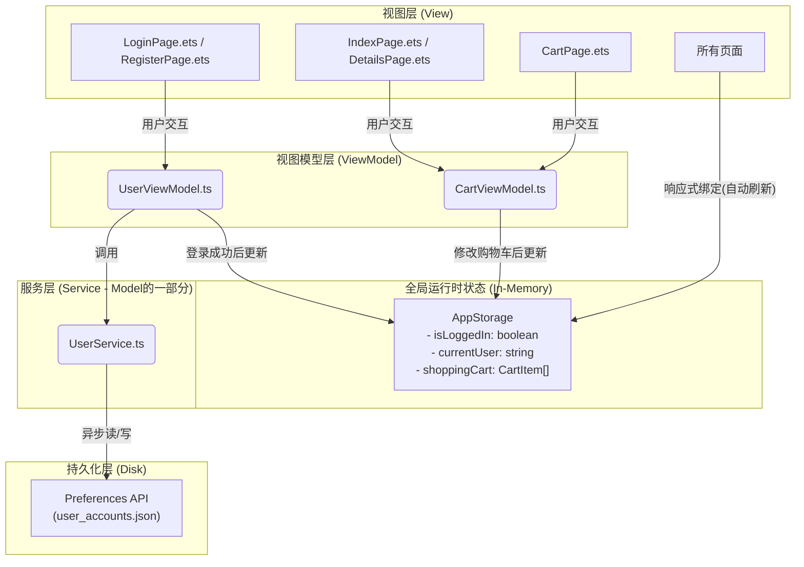

## **项目架构设计书 - 简易购物平台**

**版本：V1.0**
**目标：** 为“拼夕夕商店”项目建立一个遵循MVVM（Model-View-ViewModel）设计模式、职责分离、易于维护和扩展的软件架构。

### **1. 核心架构理念：MVVM**

我们将采用\*\*MVVM（Model-View-ViewModel）\*\*作为核心架构模式。这是鸿蒙ArkUI开发官方推荐的模式，能极大地提升代码的组织性和可测试性。

* **Model (模型)**: 负责数据和业务逻辑的原始表示。在我们的项目中，这包括数据结构（如`Product`, `User`）和数据服务（如与`Preferences`的交互）。
* **View (视图)**: 负责UI的展示。它应该是“哑”的，只负责渲染ViewModel提供的数据，并将用户操作（如点击）通知给ViewModel。我们的`.ets`页面和自定义组件都属于这一层。
* **ViewModel (视图模型)**: 作为View和Model之间的桥梁。它从Model层获取数据，处理所有业务逻辑，并管理View所需的状态。View通过数据绑定来响应ViewModel中状态的变化。

### **2. 项目目录结构**

为了实现上述MVVM模式，我建议采用以下目录结构。这能确保不同职责的代码物理分离，一目了然。

```
/entry/src/main/ets
├── common/
│   └── Constants.ts          // 应用常量 (如 AppStorage 的 Key, Preferences 文件名)
│
├── model/
│   ├── Product.ts            // 商品数据模型接口
│   ├── User.ts               // 用户数据模型接口
│   ├── CartItem.ts           // 购物车项模型接口
│   └── DataSource.ts         // 硬编码的商品数据源 (静态数据)
│
├── service/
│   └── UserService.ts          // 封装 Preferences 操作，负责用户注册和登录验证的底层服务
│
├── view/
│   ├── ProductCard.ets         // [可复用] 商品卡片自定义组件
│   ├── CartItemView.ets        // [可复用] 购物车列表项自定义组件
│   └── BottomTabs.ets          // [可复用] 底部导航栏容器组件
│
├── viewmodel/
│   ├── CartViewModel.ts        // 购物车的业务逻辑和状态管理
│   └── UserViewModel.ts        // 登录/注册页面的业务逻辑和状态管理
│
└── pages/
    ├── Index.ets               // 首页 (View)
    ├── CartPage.ets            // 购物车页面 (View)
    ├── DetailsPage.ets         // 商品详情页 (View)
    ├── LoginPage.ets           // 登录页 (View)
    ├── RegisterPage.ets        // 注册页 (View)
    └── CheckoutSuccessPage.ets // 结算成功页 (View)
```

### **3. 数据流与状态管理架构**

这是本架构的核心。我们将严格区分持久化数据和运行时状态，并明确它们各自的管理职责。

**架构图:**



**详细说明:**

1. **持久化层 (`Preferences`)**:
   * 由且仅由 `UserService.ts` 进行访问。任何其他模块都不应直接操作`Preferences`。
   * `UserService` 负责将用户对象数组序列化为JSON字符串进行存储，并在读取时反序列化。它对外提供清晰的异步接口，如 `registerUser(user)` 和 `login(username, password)`。

2. **全局运行时状态 (`AppStorage`)**:
   * 作为应用当前会话的“**单一数据源**”。
   * **`isLoggedIn` 和 `currentUser`**: 由 `UserViewModel` 在登录或退出时进行更新。
   * **`shoppingCart`**: 由 `CartViewModel` 进行所有增、删、改操作。
   * **视图层 (`View`)**: 通过 `@StorageLink` 或 `@StorageProp` 装饰器订阅 `AppStorage` 中的数据，实现UI的自动、响应式更新。

3. **本地UI状态 (`@State`)**:
   * 对于仅在单个组件内部使用的状态（如输入框的文本内容、某个开关的状态），应使用 `@State`，避免不必要的全局污染。

### **4. 导航（Routing）架构**

我们将结合使用鸿蒙的 `Tabs` 组件和 `router` 模块来构建导航。

1. **主导航容器 (`BottomTabs.ets`)**:
   * 创建一个名为 `BottomTabs.ets` 的自定义组件。
   * 内部使用 `Tabs` 组件，`barPosition` 设置为 `BarPosition.End`。
   * 包含两个 `TabContent`，分别对应 `Index.ets` (首页) 和 `CartPage.ets` (购物车页)。
   * 这个 `BottomTabs` 组件将作为应用的入口和根视图。

2. **页面跳转 (`router`)**:
   * **`router.pushUrl()`**: 用于从主页面“下钻”到次级页面。
     * `Index` -> `DetailsPage`
     * `Index` -> `LoginPage`
   * **`router.replaceUrl()`**: 用于在同一层级的流程中切换，不保留历史记录。
     * `LoginPage` <-> `RegisterPage`
   * **`router.back()`**: 用于从次级页面返回上一级。
     * `DetailsPage` -> `Index`
     * `LoginPage` (登录成功后) -> `Index`

### **5. 实施建议**

1. **第一步：搭建骨架**
   * 按照上述目录结构创建所有文件夹和空的 `.ts` / `.ets` 文件。
   * 定义 `model` 目录下的所有数据模型接口。

2. **第二步：实现用户持久化**
   * 编写 `UserService.ts`，封装对 `Preferences` 的所有操作。这是整个数据持久化的基石。
   * 编写 `UserViewModel.ts`，调用 `UserService` 并处理注册/登录的业务逻辑。

3. **第三步：构建视图和交互**
   * 从 `LoginPage` 和 `RegisterPage` 开始，将UI与 `UserViewModel` 连接起来，调通整个用户流程。
   * 接着构建 `BottomTabs` 和 `IndexPage`，展示商品列表。
   * 实现 `CartViewModel` 和 `CartPage`，完成购物车的核心功能。

